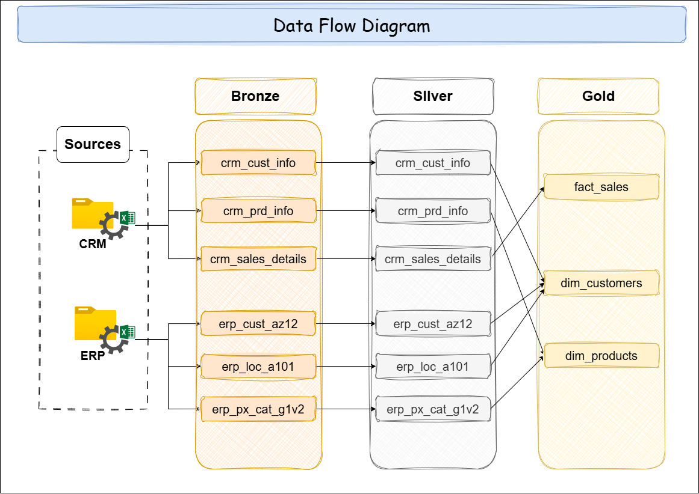

# SQL Data Warehouse Project

## Overview

This repository implements a 3-layer data warehouse architecture using SQL Server objects for Bronze, Silver, and Gold layers.

- **Bronze layer** stores raw staged source data from CRM and ERP sources.
- **Silver layer** stores cleaned, standardized, and enrichment-ready warehouse tables.
- **Gold layer** defines analytical views that expose a star schema for reporting.

The project also includes database initialization and data quality checks to support ETL development and validation.

## Initialization

The script `scripts/init_database.sql` creates the database and the required schemas:

- `DataWarehouse`
- `bronze`
- `silver`
- `gold`

Run this script first so the subsequent table creation and ETL procedures can execute in the correct database context.

## Bronze Layer

Bronze represents the raw ingestion layer and is implemented in `scripts/bronze/DDL_bronze.sql`.
It defines staging tables for CRM and ERP source feeds:

### CRM Bronze Tables

- `bronze.crm_cust_info`
  - Fields: `cst_id`, `cst_key`, `cst_firstname`, `cst_lastname`, `cst_material_status`, `cst_gendr`, `cst_create_date`
  - Purpose: raw customer master data from CRM.

- `bronze.crm_prd_info`
  - Fields: `prd_id`, `prd_key`, `prd_nm`, `prd_cost`, `prd_line`, `prd_start_date`, `prd_end_date`
  - Purpose: raw CRM product catalog data.

- `bronze.crm_sales_details`
  - Fields: `sls_ord_num`, `sls_prd_key`, `sls_cust_id`, `sls_order_dt`, `sls_ship_dt`, `sls_due_dt`, `sls_sales`, `sls_quantity`, `sls_price`
  - Purpose: raw sales transaction records; order date is preserved as source text to preserve raw format.

### ERP Bronze Tables

- `bronze.erp_cust_az12`
  - Fields: `cid`, `bdate`, `gen`
  - Purpose: ERP customer demographic data.

- `bronze.erp_loc_a101`
  - Fields: `cid`, `cntry`
  - Purpose: ERP customer geographic location data.

- `bronze.erp_px_cat_g1v2`
  - Fields: `id`, `cat`, `subcat`, `maintenance`
  - Purpose: ERP product category reference data.

### Bronze Load Procedure

The file `scripts/bronze/SP_bronze` defines `bronze.load_bronze`.
This procedure performs a full-refresh load by truncating all Bronze tables and then populating them with `BULK INSERT` operations from dataset CSV files.

Source file paths referenced in the stored procedure include:

- `datasets/source_crm/cust_info.csv`
- `datasets/source_crm/prd_info.csv`
- `datasets/source_crm/sales_details.csv`
- `datasets/source_erp/CUST_AZ12.csv`
- `datasets/source_erp/LOC_A101.csv`
- `datasets/source_erp/PX_CAT_G1V2.csv`

The procedure includes basic execution timing and error handling.

## Silver Layer

Silver represents the cleansed, standardized, and warehouse-ready layer and is implemented in `scripts/silver/DDL_silver.sql`.
It creates tables based on Bronze source data with additional audit timestamps.

### Silver Tables

- `silver.crm_cust_info`
  - Same core customer fields as Bronze plus `dwh_create_date`.
  - Purpose: cleaned and deduplicated customer master data.

- `silver.crm_prd_info`
  - Fields include `cat_id` and `sls_prd_key` derived from `prd_key`, with a `dwh_create_date`.
  - Purpose: enriched product master data for analytics.

- `silver.crm_sales_details`
  - Standardized sales transaction data with `sls_order_dt` converted to `DATE` and `dwh_create_date`.

- `silver.erp_cust_az12`
  - Cleaned ERP customer demographic data with audit timestamp.

- `silver.erp_loc_a101`
  - Cleaned ERP location data with normalized country values.

- `silver.erp_px_cat_g1v2`
  - ERP product category data passed through for later enrichment.

### Silver Load Procedure

The file `scripts/silver/SP_silver` defines `silver.load_silver`.
This procedure performs the Silver layer transformation from Bronze data and includes the following logic:

- Trim whitespace from names and IDs.
- Deduplicate CRM customer records by `cst_id`, keeping the latest by `cst_create_date`.
- Normalize CRM marital status values (`S` -> `Single`, `M` -> `Married`, otherwise `n/a`).
- Standardize gender values from CRM and ERP sources.
- Derive `cat_id` and `sls_prd_key` from CRM `prd_key` values.
- Replace missing product costs with zero.
- Normalize CRM product lines: `M` -> `Mountain`, `R` -> `Road`, `S` -> `Other Sales`, `T` -> `Touring`, otherwise `n/a`.
- Build historical product `prd_end_date` values using `LEAD()` over product versions.
- Convert order dates from raw text to `DATE`, with invalid formats becoming `NULL`.
- Recalculate inconsistent sales amounts where needed.
- Standardize negative pricing values and handle zero or missing price values.
- Clean ERP customer IDs by removing source prefixes, strip formatting characters from location IDs, and normalize country names.
- Validate ERP birthdates by nulling future dates.

The procedure also includes runtime timing and SQL Server error diagnostics.

## Gold Layer

Gold exposes analytical views over the Silver layer and is implemented in `scripts/gold/DDL_gold.sql`.
This layer does not create physical fact or dimension tables; it defines views that shape data into a star schema.

### Views

- `gold.dim_customers`
  - Builds a customer dimension by joining `silver.crm_cust_info` with ERP demographic and location tables.
  - Produces surrogate key `customer_key` using `ROW_NUMBER()`.
  - Selects customer attributes such as `customer_number`, `first_name`, `last_name`, `country`, `material_status`, `gender`, `birthdate`, and `create_date`.
  - Preference rule: CRM gender is used if available; otherwise ERP gender is used.

- `gold.dim_products`
  - Builds a product dimension by joining `silver.crm_prd_info` with ERP category metadata from `silver.erp_px_cat_g1v2`.
  - Produces surrogate key `product_key` using `ROW_NUMBER()`.
  - Includes product attributes such as `product_number`, `product_name`, `category_id`, `category`, `subcategory`, `maintenance`, `cost`, `product_line`, and `start_date`.
  - Filters to current product versions where `prd_end_date IS NULL`.

- `gold.fact_sales`
  - Builds a sales fact view by joining `silver.crm_sales_details` to the customer and product dimension views.
  - Includes business measures: `sales_amount`, `quantity`, and `price`.
  - Exposes transaction-level grain with `order_number`, `order_date`, `shipping_date`, and `due_date`.

## Data Quality Checks

The repository includes SQL validation scripts for the Silver layer in the `tests/` folder.

### `tests/quality_checks_silver.sql`

This script validates Silver table hygiene and transformation quality for:

- `silver.crm_cust_info`
  - Duplicate or NULL customer IDs
  - Leading/trailing whitespace in names
  - Standardized gender and marital status values

- `silver.crm_prd_info`
  - Duplicate or NULL product IDs
  - Whitespace in product names
  - NULL or negative costs
  - Invalid product date ranges

- `silver.crm_sales_details`
  - Whitespace in order numbers
  - Customer reference integrity against `silver.crm_cust_info`
  - Invalid order date formats
  - Chronological order date validity
  - Consistency of sales amount vs. `quantity * price`

- `silver.erp_cust_az12`
  - Duplicate customer IDs
  - Whitespace and prefix cleanup in ERP IDs
  - Future birthdate detection
  - Standardized gender values

- `silver.erp_loc_a101`
  - Country normalization validation
  - Customer ID cleanup for ERP location records

- `silver.erp_px_cat_g1v2`
  - Category ID matching and whitespace validation

### `tests/quality_checks_gold.sql`

This file is available for Gold-layer validation and can be extended to verify dimension and fact consistency after view creation.

## How to Use

1. Run `scripts/init_database.sql` to create the `DataWarehouse` database and schemas.
2. Execute `scripts/bronze/DDL_bronze.sql` to build Bronze tables.
3. Execute `scripts/silver/DDL_silver.sql` to build Silver tables.
4. Execute `scripts/gold/DDL_gold.sql` to create Gold analytical views.
5. Run the Bronze load procedure:
   - `EXEC bronze.load_bronze;`
6. Run the Silver load procedure:
   - `EXEC silver.load_silver;`
7. Validate results using the Silver quality checks in `tests/quality_checks_silver.sql`.

## Notes

- The Bronze layer uses raw source formats and preserves original data values where possible.
- The Silver layer applies cleansing, normalization, deduplication, and enrichment.
- The Gold layer exposes business-friendly analytics through views rather than permanent physical tables.
- The current design is well suited for incremental expansion into additional dimensions, facts, or source systems.

## File Summary

- `scripts/init_database.sql` - creates the database and schemas.
- `scripts/bronze/DDL_bronze.sql` - Bronze staging table definitions.
- `scripts/bronze/SP_bronze` - Bronze load stored procedure.
- `scripts/silver/DDL_silver.sql` - Silver table definitions.
- `scripts/silver/SP_silver` - Silver load stored procedure.
- `scripts/gold/DDL_gold.sql` - Gold dimension and fact views.
- `tests/quality_checks_silver.sql` - Silver layer data quality validations.
- `tests/quality_checks_gold.sql` - Placeholder for Gold layer validation.
